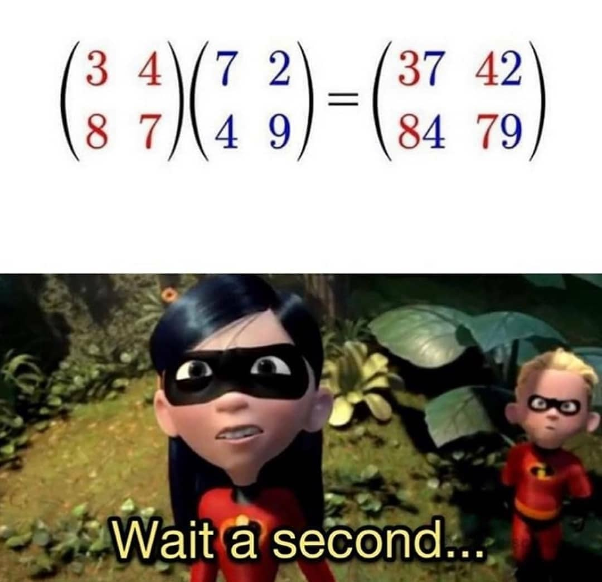

# Matrix multiplication shortcut
Lazy man's shortcut for matrix multiplication. Observe that 

<a href="https://www.codecogs.com/eqnedit.php?latex=\begin{pmatrix}&space;3&space;&&space;3&space;\\&space;3&space;&&space;3&space;\end{pmatrix}\begin{pmatrix}6&space;&&space;6&space;\\&space;6&space;&&space;6&space;\end{pmatrix}=\begin{pmatrix}&space;36&space;&&space;36&space;\\&space;36&space;&&space;36&space;\end{pmatrix}" target="_blank"></a>

<a href="https://www.codecogs.com/eqnedit.php?latex=\begin{pmatrix}&space;7&space;&&space;2&space;\\&space;8&space;&&space;2&space;\end{pmatrix}\begin{pmatrix}9&space;&&space;2&space;\\&space;8&space;&&space;4&space;\end{pmatrix}=\begin{pmatrix}&space;79&space;&&space;22&space;\\&space;88&space;&&space;24&space;\end{pmatrix}" target="_blank"></a>

<a href="https://www.codecogs.com/eqnedit.php?latex=\begin{pmatrix}&space;9&space;&&space;7&space;\\&space;6&space;&&space;5&space;\end{pmatrix}\begin{pmatrix}6&space;&&space;7&space;\\&space;6&space;&&space;2&space;\end{pmatrix}=\begin{pmatrix}&space;96&space;&&space;77&space;\\&space;66&space;&&space;52&space;\end{pmatrix}" target="_blank"></a>

Clearly, there is something spooky going on here. I have written a simple C++ program to find [all](all_matricies.txt) of the 
examples for 2x2 matricies for Natural numbers bellow 100.

```shell
$ g++ main.cpp
$ ./a.out
```

Interestingly there are exactly 100 examples. I am too lazy to discard the symmetric duplicates.


Inspired by  originally seen on [Instagram](https://www.instagram.com/p/CGU-zwnjE6r/).
